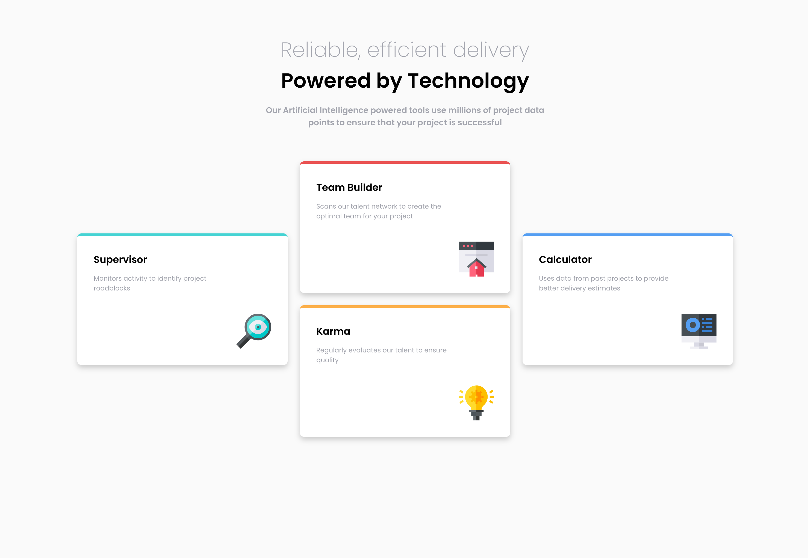

# Frontend Mentor - Four card feature section solution

This is a solution to the [Four card feature section challenge on Frontend Mentor](https://www.frontendmentor.io/challenges/four-card-feature-section-weK1eFYK). Frontend Mentor challenges help you improve your coding skills by building realistic projects. 

## Table of contents

- [Overview](#overview)
  - [The challenge](#the-challenge)
  - [Screenshot](#screenshot)
  - [Links](#links)
- [My process](#my-process)
  - [Built with](#built-with)
  - [What I learned](#what-i-learned)
  - [Continued development](#continued-development)
  - [Useful resources](#useful-resources)
- [Author](#author)

## Overview

### The challenge

Users should be able to:

- View the optimal layout for the site depending on their device's screen size

### Screenshot



### Links

- Solution URL: [Add solution URL here](https://your-solution-url.com)
- Live Site URL: [Add live site URL here](https://your-live-site-url.com)

## My process

Used this project to put in pratice all the content from the 1st part of the Codecademy course related to HTML, CSS, Responsive.

### Built with

- Semantic HTML5 markup
- CSS custom properties
- CSS Grid
- Mobile-first workflow

**Note: These are just examples. Delete this note and replace the list above with your own choices**

### What I learned

Learned how to align grid items

```html
    <div class="grid-container">

      <div class="grid-item center">
        <div class="white-card" id="cyan-border-top">
          <div class="card-title">Supervisor</div>
          <p>Monitors activity to identify project <br> roadblocks</p>
          <div class="img-container"></div>
        </div>
      </div>

      <div class="grid-item">

        <div class="flex-container">

          <div class="white-card" id="red-border-top">
            <div class="card-title">Team Builder</div>
            <p>Scans our talent network to create the <br> optimal team for your project</p>
            <div class="img-container"></div>
          </div>
  
          <div class="white-card" id="orange-border-top">
            <div class="card-title">Karma</div>
            <p>Regularly evaluates our talent to ensure <br> quality</p>
            <div class="img-container"></div>
          </div>

        </div>

      </div>

      <div class="grid-item center">
        <div class="white-card"  id="blue-border-top">
          <div class="card-title">Calculator</div>
          <p>Uses data from past projects to provide <br> better delivery estimates</p>
          <div class="img-container"></div>
        </div>
      </div>

    </div>
```
```css
.grid-container {
    display: grid;
    margin: 4em 2em 4em;
    max-width: 80em;
    gap: 1.5em;
}

@media only screen and (min-width: 1024px) {

    .center {
      align-self: center;
    }

}
```

Learned how to use border-top properties

```css
.white-card {
  border-top-style: solid;
  border-top-width: 0.3em;
  background-color: white;
  border-radius: 0.5em;
  padding: 2em;
  box-shadow: 0px 5px 10px 0px rgba(0, 0, 0, 0.2)
}

#cyan-border-top {
  border-top-color: var(--clr-prim-cyan);
}
#red-border-top {
  border-top-color: var(--clr-prim-red);
}
#orange-border-top {
  border-top-color: var(--clr-prim-orange);
}
#blue-border-top {
  border-top-color: var(--clr-prim-blue);
}
```

Learned about box-shadow properties

```css
.white-card {
  border-top-style: solid;
  border-top-width: 0.3em;
  background-color: white;
  border-radius: 0.5em;
  padding: 2em;
  box-shadow: 0px 5px 10px 0px rgba(0, 0, 0, 0.2)
}
```

### Continued development

Use this section to outline areas that you want to continue focusing on in future projects. These could be concepts you're still not completely comfortable with or techniques you found useful that you want to refine and perfect.

**Note: Delete this note and the content within this section and replace with your own plans for continued development.**

### Useful resources

- [A Complete Guide to CSS Grid](https://css-tricks.com/snippets/css/complete-guide-grid/) - This helped me understand how css grid properties work.

- [How to Apply the CSS Box-Shadow Property to Elements?](https://www.turing.com/kb/upscale-your-website-with-the-box-shadow-property) - This helped me understand how to add box shadow to elements and his properties.

## Author

- Website - [Alexandre Morgado](https://github.com/Almopt)
- Frontend Mentor - [@Almopt](https://www.frontendmentor.io/profile/Almopt)
- Twitter - [@Almo_pt](https://www.twitter.com/Almo_pt)
